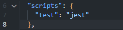

# Objective
Expand your testing capabilities by integrating and testing third-party API calls in a Node.js application using Jest. This assignment focuses on creating mock functions to simulate API calls, allowing you to test your application's response to various scenarios such as successful data retrieval and error handling.

# Instructions
## Part 1: Setup Your Testing Environment
### Repository Creation:

Create a GitHub repository named jest-api-mock-testing.
Initialize it with a .gitignore file for Node.js and a README.md file.

### Clone and Prepare:

Clone the repository to your local machine.
Inside the project directory, run npm init -y to generate a package.json file.
Install Jest by running npm install --save-dev jest.

## Part 2: Implement and Test API Integration
### API Integration Function:

Implement a function getUser in userApi.js that fetches user data from a placeholder API: https://jsonplaceholder.typicode.com/users/1.

### Write Tests for getUser:

In userApi.test.js, write tests for the getUser function to simulate:
Successful data retrieval.
Error handling for network issues or user not found.

## Part 3: Mocking External API Calls
### Mocking Setup:

Utilize Jest's mocking capabilities to intercept and mock the API calls made by getUser.
Ensure your mock simulates both success and failure scenarios effectively.

## Part 4: Error Handling and Async Testing
### Advanced Testing:

Write tests that specifically check how your application handles and recovers from errors during API calls.
Use Jest's async/await support to manage asynchronous testing cleanly.

# Submission
Push Your Code: Ensure all code changes, including your API integration and tests, are pushed to your jest-api-mock-testing repository.
README.md: Update the README.md with instructions for installing dependencies, running tests, and a brief explanation of your testing approach.

- Clone the repository, then run the command: npm i --save-dev jest
- To run tests, ensure the following code is configured in package.json:  
    
- Run the command: npm test  
  
## Functions and Tests
### getUser()
Purpose: Fetches user data from a placeholder API.
Tests:
Successful data retrieval: Verifies that data is fetched correctly from the API.
Network error handling: Ensures that network errors are properly handled.
User not found error handling: Ensures that 404 errors are properly handled.

### Mocking
Purpose: Simulate API calls without making actual network requests.
Approach: Utilized Jest's jest.mock to mock the node-fetch module. Mock implementations simulate both success and failure scenarios effectively.

# Credits
Credit to ChatGPT for assistance and code comments.